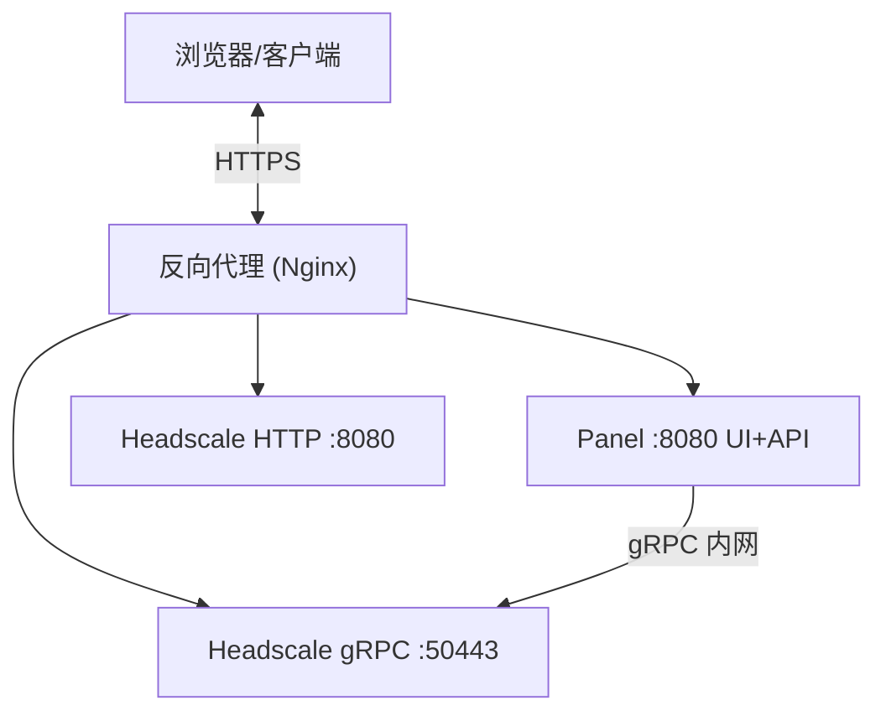

# Headscale Panel

<p align="center">
    <a href="README-zh.md">中文</a> |
    <a href="README.md">English</a>
</p>

<p align="center">
    <a href="LICENSE">
        
    </a>
    <a href="https://golang.org">
        
    </a>
    <a href="https://reactjs.org">
        
    </a>
</p>

> [!WARNING]
> 本项目目前处于非常初期的开发阶段，可能存在严重错误、功能缺失或完全不可用等问题。我们会积极跟进并解决已上报的 issue，并持续推进功能开发与 Bug 修复。非常不推荐用于公网及生产环境。

一个现代化的 Headscale 管理面板，提供简洁、面向网络运维的用户界面，支持设备管理、用户管理、ACL 可视化、路由管理、DNS 管理、在线时长统计等功能。

## 📸 界面截图

### 仪表盘


### ACL 管理


### DNS 管理


## ✨ 核心功能

### 🎨 现代化 UI
- **简洁控制台风格设计**：浅色主题，蓝色主色调，科技感十足
- **响应式布局**：支持桌面端和移动端
- **流畅动画**：平滑过渡和微交互效果
- **网络拓扑可视化**：实时展示设备连接关系及 ACL 访问矩阵
- **实时推送**：WebSocket 驱动的状态实时更新

### 📊 监控统计
- **在线时长统计**：基于 InfluxDB 的精确时长记录
- **设备状态监控**：实时显示设备在线/离线状态及历史曲线
- **流量统计**：设备流量趋势分析
- **数据可视化**：Recharts 图表展示

### 🛠️ 设备管理
- **设备列表**：查看所有已注册的设备
- **设备操作**：重命名、删除、过期、添加/修改标签
- **节点注册**：手动注册新节点到指定用户
- **筛选搜索**：按用户、状态、标签筛选
- **预授权密钥**：创建、查看、过期 PreAuthKey

### 👥 用户管理
- **Headscale 用户**：创建、重命名、删除 Headscale 网络用户
- **面板账户**：独立的面板登录账户管理，支持启用/禁用
- **网络身份绑定**：将面板账户与 Headscale 用户绑定，支持多身份
- **用户组与权限**：基于 RBAC 的用户组管理和细粒度权限分配
- **2FA 支持**：TOTP 两步验证

### 🔒 ACL 管理
- **可视化编辑**：图形化 ACL 规则编辑器，支持增删改
- **原始编辑**：直接编辑 HuJSON 原始策略内容
- **AI 辅助生成**：通过自然语言描述自动生成 ACL 规则
- **版本历史**：保留历史策略版本，支持回溯
- **访问检查**：验证特定源/目的之间的访问权限
- **一键应用**：将策略直接推送到 Headscale

### 🛣️ 路由管理
- **路由列表**：查看所有设备发布的子网路由
- **启用/禁用**：逐条控制路由的激活状态

### 🌐 DNS 管理
- **自定义记录**：管理 Headscale extra-records（A / AAAA 记录）

### 🔗 快速连接
- **命令生成**：自动生成连接命令
- **SSH 命令生成**：生成 tailscale SSH 连接命令
- **一键复制**：快速复制到剪贴板
- **PreAuthKey**：生成预授权密钥

### 📦 资源中心
- **资源管理**：以 IP + 端口形式定义内部资源（ACL 主机别名）
- **资源同步**：将资源自动同步为 ACL Hosts 条目
- **权限控制**：基于用户组的资源访问控制

### ⚙️ 系统设置
- **连接配置**：管理 Headscale gRPC 连接地址和 API Key
- **数据同步**：从 Headscale 手动同步数据

### 🆔 OIDC Provider
- **内置 OIDC**：完整实现 OpenID Connect 服务，可作为 Headscale 的认证提供者
- **外部 OIDC 登录**：支持通过外部 OIDC 提供者登录面板
- **OAuth2 客户端**：管理第三方应用接入，支持密钥轮换
- **统一认证**：一套账号管理所有服务

---

## 🚀 快速开始

### 使用 Docker（推荐）

以下方式适用于镜像/部署场景；如果是本地开发，请参考下方[本地开发](#本地开发)章节。

**拉取镜像：**

```bash
docker pull ghcr.io/headscale-panel/panel:latest
```

**使用 Docker Compose（推荐）：**

将以下内容保存为 `docker-compose.yml`，按实际需求修改配置项，然后准备 Headscale 配置文件（见下方）。

```yaml
networks:
  private:
    driver: bridge
    ipam:
      config:
        - subnet: 172.20.200.0/24

  headscale-server:
    image: headscale/headscale:stable
    container_name: headscale-server
    hostname: headscale-server
    volumes:
      - ./headscale/config:/etc/headscale
      - ./headscale/data:/var/lib/headscale
    environment:
      TZ: Asia/Shanghai
    expose:
      - '8080'
      - '50443'
    command: serve
    healthcheck:
      test: ["CMD", "headscale", "health"]
      interval: 5s
      timeout: 3s
      retries: 5
    networks:
      - private
    restart: unless-stopped
    tty: true

  headscale-panel:
    image: ghcr.io/headscale-panel/panel:latest
    container_name: headscale-panel
    hostname: headscale-panel
    volumes:
      - ./headscale/config:/app/headscale/etc
      - ./headscale/data:/app/headscale/lib
      - ./headscale/panel:/app/data
    environment:
      SYSTEM_BASE_URL: https://vpn.example.com/panel
      JWT_SECRET: 32_random_string
      JWT_EXPIRE: 24
    expose:
      - '8080'
    networks:
      - private
    depends_on:
      headscale-server:
        condition: service_healthy
    restart: unless-stopped
    tty: true
```

**启动服务：**

```bash
# 创建目录结构
mkdir -p headscale/config headscale/data panel/data

# 将下方 Headscale 配置写入 ./headscale/config/config.yaml

# 启动
docker compose up -d

# 生成 Headscale API Key（首次启动后执行）
docker exec headscale headscale apikeys create
```

首次访问面板（`http://localhost:8090` 或反向代理地址），进入初始化向导，在「连接配置」步骤填写：

- **gRPC 地址**：`headscale:50443`（面板与 Headscale 位于同一 Docker 网络，直接使用服务名）
- **API Key**：填入上方命令生成的 Key
- **允许不安全连接**：如headscale不设置ssl证书，请勾选（内网 gRPC 无 TLS，符合下方 `grpc_allow_insecure: true` 配置）

### TLS 模式选择（初始化向导/设置页）

面板支持 3 种 gRPC 连接模式，请按 Headscale gRPC 实际部署方式选择：

1. **允许不安全 gRPC（无 TLS）**
  - 适用于 Headscale gRPC 端口本身不启用 TLS 的场景。
  - 配置：`启用 TLS = 关闭`。

2. **TLS + 跳过证书验证**
  - 适用于 Headscale gRPC 使用自签名证书。
  - 配置：`启用 TLS = 开启`，`跳过 TLS 证书验证 = 开启`。

3. **TLS + 自定义 CA 证书（推荐用于私有 PKI）**
  - 适用于 gRPC 证书由私有 CA 签发。
  - 配置：`启用 TLS = 开启`，`跳过 TLS 证书验证 = 关闭`，并在 `自定义 CA 证书（PEM）` 中粘贴 CA 的 PEM 内容。
  - 如果使用公网 CA（如 ZeroSSL），`自定义 CA 证书（PEM）` 保持为空即可（使用系统根证书）。

面板通过 gRPC 连接 Headscale，需提前准备好 Headscale 配置文件。以下为推荐最小配置（`./headscale/config/config.yaml`）：

> **安全建议**：建议启用 `grpc_allow_insecure: true` 并将 gRPC 连接限制在内网环境。从安全角度考虑，通过网络隔离实现的内网无TLS连接，其安全性优于将gRPC暴露在公网并依赖证书加密的方案。

```yaml
server_url: https://vpn.example.com
listen_addr: 0.0.0.0:8080
metrics_listen_addr: 0.0.0.0:9090
grpc_listen_addr: 0.0.0.0:50443
grpc_allow_insecure: true
private_key_path: /var/lib/headscale/private.key
noise:
    private_key_path: /var/lib/headscale/noise_private.key
prefixes:
    v4: 100.100.0.0/16
    v6: fd7a:115c:a1e0::/48
    allocation: sequential
derp:
    server:
        enabled: false
    paths:
        - /etc/headscale/derp-custom.yaml
database:
    type: sqlite
    sqlite:
        path: /var/lib/headscale/db.sqlite
        write_ahead_log: true
dns:
    base_domain: example.net
    magic_dns: true
    nameservers:
        global:
            - 1.1.1.1
            - 1.0.0.1
policy:
    mode: database
```

对应的推荐最小 `./headscale/config/derp-custom.yaml`

```yaml
regions:
  900:
    regionid: 900
    regioncode: custom
    regionname: My Region
    nodes:
      - name: 900a
        regionid: 900
        hostname: myderp.example.com
        stunport: 0
        stunonly: false
        derpport: 0
```

> 更多配置项请参考：https://headscale.net/stable/ref/configuration/

### 环境变量

| 变量名                            | 说明                                     | 默认值                  |
| --------------------------------- | ---------------------------------------- | ----------------------- |
| `SYSTEM_PORT`                     | 面板监听端口                             | `:8080`                 |
| `SYSTEM_BASE_URL`                 | 面板外部访问地址（用于 OIDC 回调等）     | `http://localhost:8080` |
| `SYSTEM_SETUP_BOOTSTRAP_TOKEN`    | 初始化引导令牌（≥32 字符，留空则不启用） | —                       |
| `JWT_SECRET`                      | JWT 签名密钥（≥32 字符，留空自动生成）   | 自动生成                |
| `JWT_EXPIRE`                      | JWT 过期时间（小时）                     | `24`                    |
| `DB_PATH`                         | SQLite 数据库路径                        | `data/data.db`          |
| `INFLUXDB_URL`                    | InfluxDB 地址（留空则禁用指标统计）      | —                       |
| `INFLUXDB_TOKEN`                  | InfluxDB 认证 Token                      | —                       |
| `INFLUXDB_ORG`                    | InfluxDB 组织名                          | `headscale-panel`       |
| `INFLUXDB_BUCKET`                 | InfluxDB Bucket 名                       | `metrics`               |
| `DOCKER_DIND_ENABLED`             | 启用基于 Docker 的 Headscale 自动重启    | `false`                 |
| `DOCKER_HEADSCALE_CONTAINER_NAME` | 用于重启的 Headscale 容器名              | —                       |

---

## 🏗️ 架构说明



- **Headscale Panel**（本项目）：管理面板，提供 Web UI 和 REST API，通过 gRPC 连接 Headscale
- **Headscale**：VPN 控制平面，Tailscale 客户端直接连接此服务
- 面板和 Headscale 之间通过 gRPC 通信，通常部署在同一台服务器或内网

---

## 🌐 反向代理配置

推荐将面板挂载在 `/panel/` 路径下，与 Headscale 共用同一域名。以下为 Nginx 示例（`SYSTEM_BASE_URL=https://vpn.example.com/panel`）：

```nginx
server {
    listen 443 ssl http2;
    server_name vpn.example.com;

    ssl_certificate     /etc/ssl/certs/vpn.example.com/fullchain.pem;
    ssl_certificate_key /etc/ssl/private/vpn.example.com/privkey.pem;

    location ^~ /panel/ {
        proxy_pass http://headscale-panel:8080;
        proxy_set_header Host $host;
        proxy_set_header X-Real-IP $remote_addr;
        proxy_set_header X-Forwarded-For $proxy_add_x_forwarded_for;
        proxy_set_header X-Forwarded-Proto $scheme;
        proxy_http_version 1.1;
        proxy_set_header Upgrade $http_upgrade;
        proxy_set_header Connection "upgrade";
    }

    location ^~ / {
        proxy_pass http://headscale-server:8080;
        proxy_set_header Host $host;
        proxy_set_header X-Real-IP $remote_addr;
        proxy_set_header X-Forwarded-For $proxy_add_x_forwarded_for;
        proxy_set_header X-Forwarded-Proto $scheme;
        proxy_http_version 1.1;
        proxy_set_header Upgrade $http_upgrade;
        proxy_set_header Connection "upgrade";
    }
}
```

> 使用面板内置 OIDC 时，还需确保 `/.well-known/openid-configuration` 和 `/api/v1/oidc/` 路径能到达面板（即额外添加对应 `location` 块，`proxy_pass` 同面板地址）。

---

## 🔧 开发指南

### 前置要求

- Docker + Docker Compose
- Go 1.24+
- Node.js 24+ / pnpm

### 本地开发

推荐流程：

```bash
# 1) 初始化 .env 及 Headscale 配置文件（不会覆盖已有文件）
./shell/dev/01-init.sh

# 2) 启动外部依赖（Headscale + InfluxDB）
./shell/dev/02-start.sh

# 3) 生成 Headscale API Key
docker exec panel-dev-headscale headscale apikeys create

# 4) 启动本地后端
cd backend && go run .

# 5) 启动本地前端
cd frontend && pnpm install && pnpm dev
```

### Headscale gRPC TLS 证书

本地/手工测试 Headscale gRPC TLS 时，可使用 `shell/certs/` 下的证书脚本：

```bash
# 自签名服务端证书（面板：启用 TLS + 跳过验证）
./shell/certs/01-self-signed.sh

# 私有 CA + 服务端证书（面板：启用 TLS + 粘贴 CA PEM，不跳过验证）
./shell/certs/02-private-ca.sh
```

上述脚本产物统一写入 `shell/docker/dev/cert`，该目录已挂载到 headscale 容器的 `/etc/cert`（只读）。生成证书后，在 headscale 配置中指定证书路径：

```yaml
# backend/data/headscale/etc/config.yaml
tls_cert_path: /etc/cert/server.crt
tls_key_path:  /etc/cert/server.key
```

> **注意**：`CN` 参数必须与面板实际连接的 gRPC 地址一致。例如 `CN=127.0.0.1` 会生成 IP SAN，`CN=headscale` 会生成 DNS SAN。不匹配会导致 `x509: cannot validate certificate ... doesn't contain any IP SANs` 错误。

### 使用与开发测试流程

> `01-init.sh` 会自动在 `backend/data/headscale/` 下创建 Headscale 配置文件（若不存在），并默认打开本地 DinD 重启配置以及 InfluxDB 连接配置。

外部依赖脚本速查：

```bash
# 初始化 .env 文件（不会覆盖已有文件）
./shell/dev/01-init.sh

# 启动外部依赖（默认启动 Headscale + InfluxDB）
./shell/dev/02-start.sh

# 重启外部依赖
./shell/dev/03-restart.sh

# 停止外部依赖
./shell/dev/04-stop.sh

# 清空依赖数据（慎用）
./shell/dev/99-reset.sh
```

默认访问地址与端口：

- Headscale HTTP: http://localhost:5080
- Headscale gRPC: localhost:50443
- InfluxDB: http://localhost:8086
- tailnet 测试页: http://172.30.0.10/tailnet-test（路由批准后可访问）

外部依赖会启动以下服务：

- Headscale
- InfluxDB
- Tailscale 子网路由器与测试 nginx

Headscale 连接（gRPC 地址和 API Key）通过 WebUI 初始化向导或「设置 → 连接配置」完成。

如需验证其他 tailnet 设备是否可以访问容器网段：

1. 执行 `./shell/dev/02-start.sh`。
2. 登录测试环境的 tailscale 客户端。
3. 在 Headscale 中批准 `172.30.0.0/24` 子网路由。
4. 在另一台 tailnet 设备上访问 `http://172.30.0.10/tailnet-test`。

如需在容器部署中启用 DinD 自动重启，请保持 `DOCKER_DIND_ENABLED=true`，挂载 `/var/run/docker.sock`，并确保镜像内包含 Docker CLI。

### 构建 Docker 镜像

```bash
docker build -t headscale-panel .
```

---

## 📄 License

GNU AGPLv3
