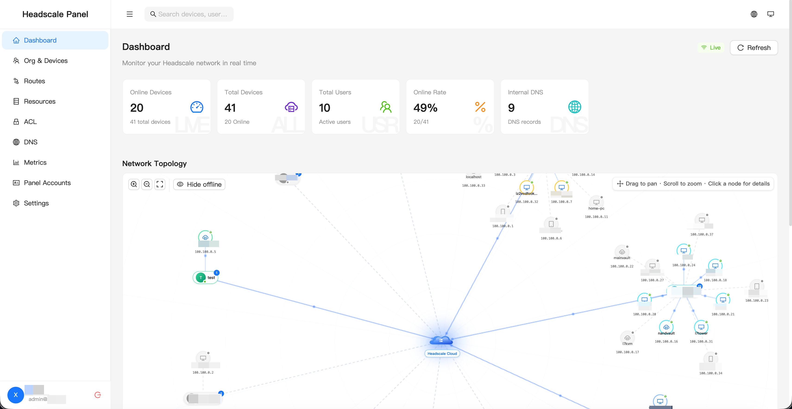
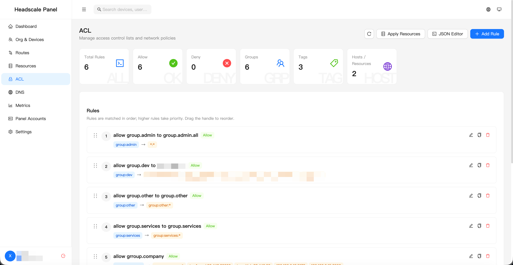
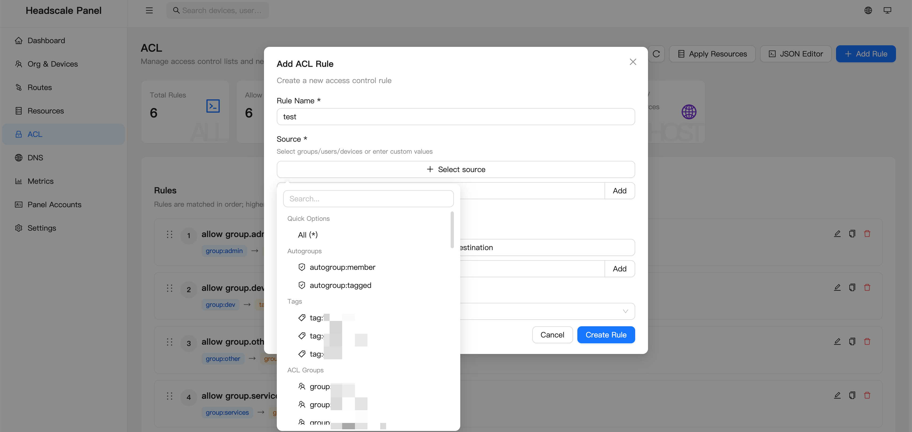
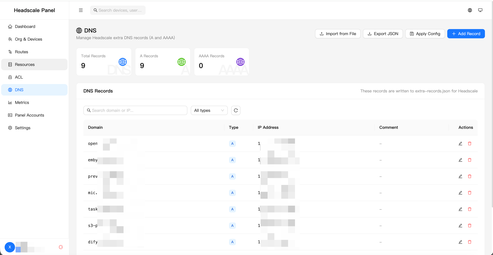
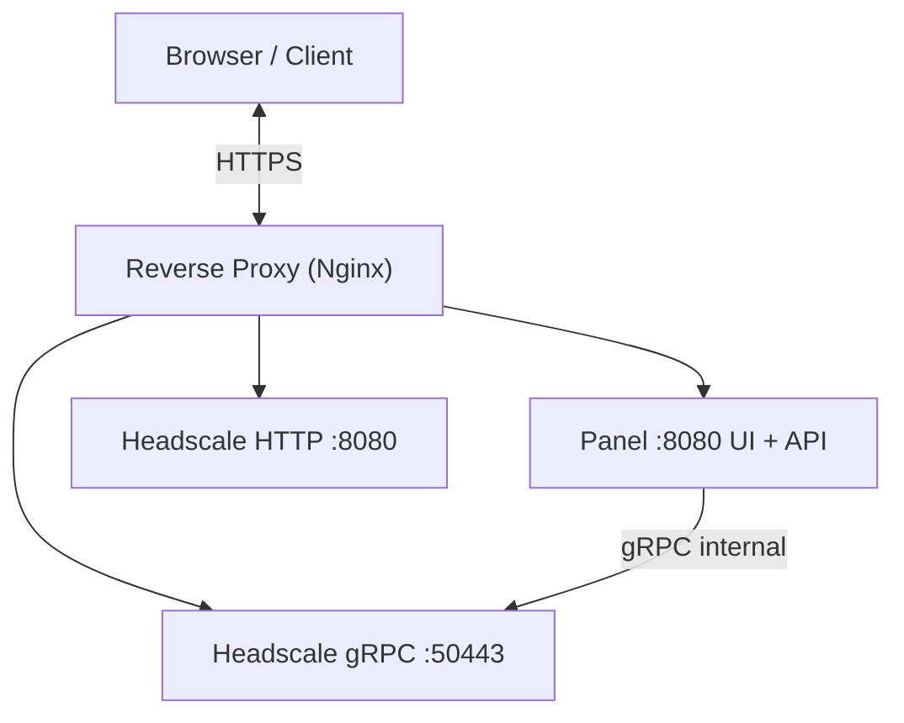

# Headscale Panel

<p align="center">
    <a href="README-zh.md">中文</a> |
    <a href="README.md">English</a>
</p>

<p align="center">
    <a href="LICENSE">
        
    </a>
    <a href="https://golang.org">
        
    </a>
    <a href="https://reactjs.org">
        
    </a>
</p>

A modern Headscale management panel with a clean, network-operations-focused UI. Supports device management, user management, ACL visualization, route management, DNS management, uptime statistics, and more.

## 📸 Screenshots

### Dashboard



### ACL





### DNS



## ✨ Features

### 🎨 Modern UI
- **Clean dashboard design**: Light theme with a blue accent color palette
- **Responsive layout**: Works on both desktop and mobile
- **Smooth animations**: Polished transitions and micro-interactions
- **Network topology visualization**: Real-time device connection graph and ACL access matrix
- **Real-time updates**: WebSocket-powered live state refresh

### 📊 Monitoring & Statistics
- **Uptime tracking**: Accurate session duration recording backed by InfluxDB
- **Device status monitoring**: Real-time online/offline indicators with historical charts
- **Traffic statistics**: Device traffic trend analysis
- **Data visualization**: Interactive charts powered by Recharts

### 🛠️ Device Management
- **Device list**: Browse all registered devices
- **Device actions**: Rename, delete, expire, add/edit tags
- **Node registration**: Manually register new nodes to a specific user
- **Filtering & search**: Filter by user, status, or tag
- **Pre-auth keys**: Create, view, and expire PreAuthKeys

### 👥 User Management
- **Headscale users**: Create, rename, and delete Headscale network users
- **Panel accounts**: Standalone panel login accounts with enable/disable support
- **Identity binding**: Bind panel accounts to Headscale users (multiple identities supported)
- **Groups & permissions**: RBAC-based group management with fine-grained permission assignment
- **2FA support**: TOTP two-factor authentication

### 🔒 ACL Management
- **Visual editor**: Graphical ACL rule editor with add/edit/delete support
- **Raw editor**: Direct HuJSON policy editing
- **AI-assisted generation**: Auto-generate ACL rules from natural language descriptions
- **Version history**: Keeps historical policy versions for rollback
- **Access check**: Verify access permissions between a given source and destination
- **One-click apply**: Push the policy directly to Headscale

### 🛣️ Route Management
- **Route list**: View all subnet routes advertised by devices
- **Enable/Disable**: Toggle individual route activation state

### 🌐 DNS Management
- **Custom records**: Manage Headscale extra-records (A / AAAA records)

### 🔗 Quick Connect
- **Command generation**: Auto-generate connection commands
- **SSH command generation**: Generate Tailscale SSH connection commands
- **One-click copy**: Copy to clipboard instantly
- **PreAuthKey**: Generate pre-authorization keys

### 📦 Resource Center
- **Resource management**: Define internal resources by IP + port (ACL host aliases)
- **Resource sync**: Automatically sync resources as ACL Hosts entries
- **Access control**: Group-based resource access control

### ⚙️ System Settings
- **Connection config**: Manage the Headscale gRPC address and API key
- **Data sync**: Manually sync data from Headscale

### 🆔 OIDC Provider
- **Built-in OIDC**: Full OpenID Connect implementation — use this panel as Headscale's authentication provider
- **External OIDC login**: Log in to the panel via an external OIDC provider
- **OAuth2 clients**: Manage third-party application access with key rotation support
- **Unified authentication**: One account for all services

---

## 🚀 Quick Start

### Using Docker (Recommended)

The steps below are for deploying a production instance. For local development, see the [Development](#development) section below.

**Pull the image:**

```bash
docker pull ghcr.io/headscale-panel/panel:latest
```

**Using Docker Compose (Recommended):**

Save the following as `docker-compose.yml`, adjust configuration items according to your actual needs, then prepare the Headscale config file (see below).

```yaml
networks:
  private:
    driver: bridge
    ipam:
      config:
        - subnet: 172.20.200.0/24

services:
  headscale:
    image: headscale/headscale:stable
    container_name: headscale
    networks:
      - private
    volumes:
      - ./headscale/config:/etc/headscale        # Headscale config directory
      - ./headscale/data:/var/lib/headscale       # Headscale persistent data
      - /usr/share/zoneinfo/Asia/Shanghai:/etc/localtime:ro
    ports:
      - "8080:8080"    # Tailscale client ingress port (must be publicly accessible)
    expose:
      - "50443"   # gRPC port (internal panel access only; no need to expose externally)
    command: serve
    restart: unless-stopped
    healthcheck:
      test: ["CMD", "headscale", "health"]
      interval: 5s
      timeout: 3s
      retries: 5

  panel:
    image: ghcr.io/headscale-panel/panel:latest
    container_name: headscale-panel
    restart: unless-stopped
    networks:
      - private
    ports:
      - "8090:8080"    # Panel web interface (pair with a reverse proxy; avoid direct public exposure)
    volumes:
      - ./headscale/config:/app/headscale/etc
      - ./headscale/data:/app/headscale/lib
      - ./headscale/panel:/app/data
      - /var/run/docker.sock:/var/run/docker.sock
    environment:
      - TZ=Asia/Shanghai
      - SYSTEM_BASE_URL=https://vpn.example.com
      - JWT_SECRET=random_str_len_32
      - DOCKER_DIND_ENABLED=true
      - DOCKER_HEADSCALE_CONTAINER_NAME=headscale
    depends_on:
      headscale:
        condition: service_healthy
```

**Start the services:**

```bash
# Create the directory structure
mkdir -p headscale/config headscale/data panel/data

# Write the Headscale config to ./headscale/config/config.yaml (see below)

# Start
docker compose up -d

# Generate a Headscale API key (run after first startup)
docker exec headscale headscale apikeys create
```

On first access (`http://localhost:8090` or your reverse-proxy address), the setup wizard will open. In the **Connection** step, fill in:

- **gRPC address**: `headscale:50443` (panel and Headscale share the same Docker network — use the service name)
- **API Key**: the key generated by the command above
- **Allow insecure connection**: check this if Headscale has no TLS certificate (internal gRPC without TLS, matching `grpc_allow_insecure: true` in the config below)

The panel connects to Headscale over gRPC. Below is the recommended minimal Headscale config (`./headscale/config/config.yaml`):

```yaml
server_url: https://vpn.example.com
listen_addr: 0.0.0.0:8080
metrics_listen_addr: 0.0.0.0:9090
grpc_listen_addr: 0.0.0.0:50443
grpc_allow_insecure: true
private_key_path: /var/lib/headscale/private.key
noise:
    private_key_path: /var/lib/headscale/noise_private.key
prefixes:
    v4: 100.100.0.0/16
    v6: 64:ff9b::/96
    allocation: sequential
derp:
    server:
        enabled: false
    paths:
        - /etc/headscale/derp-custom.yaml
database:
    type: sqlite
    sqlite:
        path: /var/lib/headscale/db.sqlite
        write_ahead_log: true
dns:
    base_domain: example.net
    magic_dns: true
    nameservers:
        global:
            - 1.1.1.1
            - 1.0.0.1
policy:
    mode: database
```

Corresponding recommended minimal `./headscale/config/derp-custom.yaml`:

```yaml
regions:
  900:
    regionid: 900
    regioncode: custom
    regionname: My Region
    nodes:
      - name: 900a
        regionid: 900
        hostname: myderp.example.com
        stunport: 0
        stunonly: false
        derpport: 0
```

> For additional configuration options, see: https://headscale.net/stable/ref/configuration/

### Environment Variables

| Variable                          | Description                                                 | Default                 |
| --------------------------------- | ----------------------------------------------------------- | ----------------------- |
| `SYSTEM_PORT`                     | Panel listen port                                           | `:8080`                 |
| `SYSTEM_BASE_URL`                 | External panel URL (used for OIDC callbacks, etc.)          | `http://localhost:8080` |
| `SYSTEM_SETUP_BOOTSTRAP_TOKEN`    | Setup wizard bootstrap token (≥32 chars; disabled if empty) | —                       |
| `JWT_SECRET`                      | JWT signing secret (≥32 chars; auto-generated if empty)     | auto-generated          |
| `JWT_EXPIRE`                      | JWT expiration time (hours)                                 | `24`                    |
| `DB_PATH`                         | SQLite database file path                                   | `data/data.db`          |
| `INFLUXDB_URL`                    | InfluxDB address (metrics disabled if empty)                | —                       |
| `INFLUXDB_TOKEN`                  | InfluxDB authentication token                               | —                       |
| `INFLUXDB_ORG`                    | InfluxDB organization name                                  | `headscale-panel`       |
| `INFLUXDB_BUCKET`                 | InfluxDB bucket name                                        | `metrics`               |
| `DOCKER_DIND_ENABLED`             | Enable Docker-based Headscale restart after config changes  | `false`                 |
| `DOCKER_HEADSCALE_CONTAINER_NAME` | Headscale container name used for restart                   | —                       |

---

## 🏗️ Architecture



- **Headscale Panel** (this project): Management panel providing a Web UI and REST API; communicates with Headscale over gRPC.
- **Headscale**: VPN control plane; Tailscale clients connect directly to this service.
- The panel and Headscale communicate via gRPC and are typically deployed on the same host or within the same internal network.

---

## 🌐 Reverse Proxy Configuration

It is recommended to mount the panel under a `/panel/` path and share the same domain as Headscale. The Nginx example below has the panel listening on `:8090` and `SYSTEM_BASE_URL=https://vpn.example.com/panel`:

```nginx
server {
    listen 443 ssl http2;
    server_name vpn.example.com;

    ssl_certificate     /etc/letsencrypt/live/vpn.example.com/fullchain.pem;
    ssl_certificate_key /etc/letsencrypt/live/vpn.example.com/privkey.pem;

    # Panel UI + API
    location /panel/ {
        proxy_pass http://127.0.0.1:8090/;
        proxy_set_header Host $host;
        proxy_set_header X-Real-IP $remote_addr;
        proxy_set_header X-Forwarded-For $proxy_add_x_forwarded_for;
        proxy_set_header X-Forwarded-Proto $scheme;
        proxy_http_version 1.1;
        proxy_set_header Upgrade $http_upgrade;
        proxy_set_header Connection "upgrade";
    }

    # All other traffic goes to Headscale (Tailscale client connections)
    # Headscale reverse-proxy reference: https://headscale.net/stable/ref/integration/reverse-proxy
    location / {
        proxy_pass http://127.0.0.1:8080;  # Headscale HTTP port
        proxy_set_header Host $host;
        proxy_set_header X-Real-IP $remote_addr;
        proxy_set_header X-Forwarded-For $proxy_add_x_forwarded_for;
        proxy_set_header X-Forwarded-Proto $scheme;
        proxy_http_version 1.1;
        proxy_set_header Upgrade $http_upgrade;
        proxy_set_header Connection "upgrade";
    }
}
```

> When using the built-in OIDC provider, also ensure that `/.well-known/openid-configuration` and `/api/v1/oidc/` paths route to the panel (add corresponding `location` blocks with the same `proxy_pass` address).

---

## 🔧 Development

### Prerequisites

- Docker + Docker Compose
- Go 1.24+
- Node.js 20+ / pnpm

### Local Development

Recommended workflow:

```bash
# 1) Initialize .env and Headscale config files (existing files are not overwritten)
./shell/dev/01-init.sh

# 2) Start external dependencies (Headscale + InfluxDB)
./shell/dev/02-start.sh

# 3) Generate a Headscale API Key
docker exec panel-dev-headscale headscale apikeys create

# 4) Start the local backend
cd backend && go run .

# 5) Start the local frontend
cd frontend && pnpm install && pnpm dev
```

> `01-init.sh` automatically creates the Headscale config under `backend/data/headscale/` if it does not already exist, enables local DinD restarts, and points the backend at the bundled InfluxDB container.

Helper script reference:

```bash
# Initialize .env (does not overwrite existing files)
./shell/dev/01-init.sh

# Start external dependencies (Headscale + InfluxDB)
./shell/dev/02-start.sh

# Restart external dependencies
./shell/dev/03-restart.sh

# Stop external dependencies
./shell/dev/04-stop.sh

# Reset all dependency data (destructive!)
./shell/dev/99-reset.sh
```

Default addresses and ports:

- Headscale HTTP: http://localhost:5080
- Headscale gRPC: localhost:50443
- InfluxDB: http://localhost:8086
- Tailnet-only nginx test target: http://172.30.0.10 (after route approval)

External dependencies include:

- Headscale
- InfluxDB
- Tailscale subnet router and internal nginx test target

The Headscale connection (gRPC address and API key) is configured via the Web UI setup wizard or **Settings → Connection Config**.

To test subnet routing from other tailnet devices:

1. Start `./shell/dev/02-start.sh`.
2. Login the test-environment Tailscale client.
3. Approve the advertised `172.30.0.0/24` route in Headscale.
4. From another tailnet device, open `http://172.30.0.10`.

To use DinD auto-restart in container deployments, keep `DOCKER_DIND_ENABLED=true`, mount `/var/run/docker.sock`, and ensure the image contains the Docker CLI.

### Building the Docker Image

```bash
docker build -t headscale-panel .
```

---

## 📄 License

GNU AGPLv3
