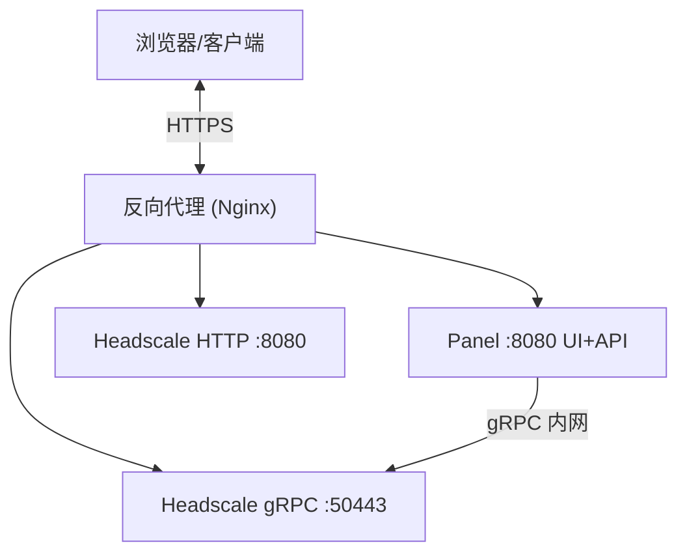

# Headscale Panel

<p align="center">
    <a href="LICENSE">
        
    </a>
    <a href="https://golang.org">
        
    </a>
    <a href="https://reactjs.org">
        
    </a>
</p>

一个现代化的 Headscale 管理面板，提供类似 UniFi 风格的用户界面，支持设备管理、用户管理、ACL 可视化、路由管理、DNS 管理、在线时长统计等功能。

## ✨ 核心功能

### 🎨 现代化 UI
- **UniFi 风格设计**：浅色主题，蓝色主色调，科技感十足
- **响应式布局**：支持桌面端和移动端
- **流畅动画**：平滑过渡和微交互效果
- **网络拓扑可视化**：实时展示设备连接关系及 ACL 访问矩阵
- **实时推送**：WebSocket 驱动的状态实时更新

### 📊 监控统计
- **在线时长统计**：基于 InfluxDB 的精确时长记录
- **设备状态监控**：实时显示设备在线/离线状态及历史曲线
- **流量统计**：设备流量趋势分析
- **数据可视化**：Recharts 图表展示

### 🛠️ 设备管理
- **设备列表**：查看所有已注册的设备
- **设备操作**：重命名、删除、过期、添加/修改标签
- **节点注册**：手动注册新节点到指定用户
- **筛选搜索**：按用户、状态、标签筛选
- **预授权密钥**：创建、查看、过期 PreAuthKey

### 👥 用户管理
- **Headscale 用户**：创建、重命名、删除 Headscale 网络用户
- **面板账户**：独立的面板登录账户管理，支持启用/禁用
- **网络身份绑定**：将面板账户与 Headscale 用户绑定，支持多身份
- **用户组与权限**：基于 RBAC 的用户组管理和细粒度权限分配
- **2FA 支持**：TOTP 两步验证

### 🔒 ACL 管理
- **可视化编辑**：图形化 ACL 规则编辑器，支持增删改
- **原始编辑**：直接编辑 HuJSON 原始策略内容
- **AI 辅助生成**：通过自然语言描述自动生成 ACL 规则
- **版本历史**：保留历史策略版本，支持回溯
- **访问检查**：验证特定源/目的之间的访问权限
- **一键应用**：将策略直接推送到 Headscale

### 🛣️ 路由管理
- **路由列表**：查看所有设备发布的子网路由
- **启用/禁用**：逐条控制路由的激活状态

### 🌐 DNS 管理
- **自定义记录**：管理 Headscale extra-records（A / AAAA 记录）

### 🔗 快速连接
- **命令生成**：自动生成连接命令
- **SSH 命令生成**：生成 tailscale SSH 连接命令
- **一键复制**：快速复制到剪贴板
- **PreAuthKey**：生成预授权密钥

### 📦 资源中心
- **资源管理**：以 IP + 端口形式定义内部资源（ACL 主机别名）
- **资源同步**：将资源自动同步为 ACL Hosts 条目
- **权限控制**：基于用户组的资源访问控制

### ⚙️ 系统设置
- **连接配置**：管理 Headscale gRPC 连接地址和 API Key
- **数据同步**：从 Headscale 手动同步数据

### 🆔 OIDC Provider
- **内置 OIDC**：完整实现 OpenID Connect 服务，可作为 Headscale 的认证提供者
- **外部 OIDC 登录**：支持通过外部 OIDC 提供者登录面板
- **OAuth2 客户端**：管理第三方应用接入，支持密钥轮换
- **统一认证**：一套账号管理所有服务

---

## 🚀 快速开始

### 使用 Docker（推荐）

以下方式适用于镜像/部署场景；如果是本地开发，请参考下方[本地开发](#本地开发)章节。

```bash
# 构建镜像
docker build -t headscale-panel .

# 运行容器
docker run -d \
  --name headscale-panel \
  -p 8080:8080 \
  -v $(pwd)/data:/app/data \
  -e SYSTEM_BASE_URL=https://vpn.example.com \
  headscale-panel
```

首次启动后访问 `http://localhost:8080`，进入初始化向导配置 gRPC 连接和管理员账户。

面板通过 gRPC 连接 Headscale，需提前准备好 Headscale 并生成 API Key。以下为 Headscale 推荐最小配置（`/etc/headscale/config.yaml`）：

```yaml
server_url: https://vpn.example.com
listen_addr: 0.0.0.0:8080
metrics_listen_addr: 0.0.0.0:9090
grpc_listen_addr: 0.0.0.0:50443
grpc_allow_insecure: true
private_key_path: /var/lib/headscale/private.key
noise:
    private_key_path: /var/lib/headscale/noise_private.key
prefixes:
    v4: 100.64.0.0/10
    v6: ""
    allocation: sequential
derp:
    server:
        enabled: false
database:
    type: sqlite
    sqlite:
        path: /var/lib/headscale/db.sqlite
        write_ahead_log: true
dns:
    base_domain: example.net
    magic_dns: true
    nameservers:
        global:
            - 1.1.1.1
            - 1.0.0.1
policy:
    mode: database
```

> 更多配置项请参考：https://headscale.net/stable/ref/configuration/

### 环境变量

| 变量名                         | 说明                                     | 默认值                  |
| ------------------------------ | ---------------------------------------- | ----------------------- |
| `SYSTEM_PORT`                  | 面板监听端口                             | `:8080`                 |
| `SYSTEM_BASE_URL`              | 面板外部访问地址（用于 OIDC 回调等）     | `http://localhost:8080` |
| `SYSTEM_SETUP_BOOTSTRAP_TOKEN` | 初始化引导令牌（≥32 字符，留空则不启用） | —                       |
| `JWT_SECRET`                   | JWT 签名密钥（≥32 字符，留空自动生成）   | 自动生成                |
| `JWT_EXPIRE`                   | JWT 过期时间（小时）                     | `24`                    |
| `INFLUXDB_URL`                 | InfluxDB 地址（留空则禁用指标统计）      | —                       |
| `INFLUXDB_TOKEN`               | InfluxDB 认证 Token                      | —                       |
| `INFLUXDB_ORG`                 | InfluxDB 组织名                          | `headscale-panel`       |
| `INFLUXDB_BUCKET`              | InfluxDB Bucket 名                       | `metrics`               |

---

## 🏗️ 架构说明



- **Headscale Panel**（本项目）：管理面板，提供 Web UI 和 REST API，通过 gRPC 连接 Headscale
- **Headscale**：VPN 控制平面，Tailscale 客户端直接连接此服务
- 面板和 Headscale 之间通过 gRPC 通信，通常部署在同一台服务器或内网

---

## 🌐 反向代理配置

推荐将面板挂载在 `/panel/` 路径下，与 Headscale 共用同一域名。以下为 Nginx 示例（Panel 监听 `:8090`，`SYSTEM_BASE_URL=https://vpn.example.com/panel`）：

```nginx
server {
    listen 443 ssl http2;
    server_name vpn.example.com;

    ssl_certificate     /etc/letsencrypt/live/vpn.example.com/fullchain.pem;
    ssl_certificate_key /etc/letsencrypt/live/vpn.example.com/privkey.pem;

    # 管理面板 UI + API
    location /panel/ {
        proxy_pass http://127.0.0.1:8090/;
        proxy_set_header Host $host;
        proxy_set_header X-Real-IP $remote_addr;
        proxy_set_header X-Forwarded-For $proxy_add_x_forwarded_for;
        proxy_set_header X-Forwarded-Proto $scheme;
        proxy_http_version 1.1;
        proxy_set_header Upgrade $http_upgrade;
        proxy_set_header Connection "upgrade";
    }

    # 其余流量交给 Headscale（Tailscale 客户端连接）
    # Headscale 反向代理配置参考：https://headscale.net/stable/ref/integration/reverse-proxy
    location / {
        # proxy_pass http://127.0.0.1:8080;  # Headscale HTTP 端口
    }
}
```

> 面板内置 OIDC 时，还需确保 `/.well-known/openid-configuration` 和 `/api/v1/oidc/` 路径能到达面板（即额外添加对应 `location` 块，`proxy_pass` 同面板地址）。

---

## 🔧 开发指南

### 前置要求

- Docker + Docker Compose
- Go 1.24+
- Node.js 20+ / pnpm

### 本地开发

推荐流程：

```bash
# 1) 初始化 .env 及 Headscale 配置文件（不会覆盖已有文件）
./shell/dev/01-init.sh

# 2) 启动外部依赖（Headscale 等）
./shell/dev/02-start.sh

# 3) 生成 Headscale API Key
docker exec panel-dev-headscale headscale apikeys create

# 4) 启动本地后端
cd backend && go run .

# 5) 启动本地前端
cd frontend && pnpm install && pnpm dev
```

> `01-init.sh` 会自动在 `backend/data/headscale/` 下创建 Headscale 配置文件（若不存在）。

外部依赖脚本速查：

```bash
# 初始化 .env 文件（不会覆盖已有文件）
./shell/dev/01-init.sh

# 启动外部依赖（默认只启动 Headscale）
./shell/dev/02-start.sh

# 启动外部依赖并启用 DERP
WITH_DERP=true ./shell/dev/02-start.sh

# 重启外部依赖
./shell/dev/03-restart.sh

# 停止外部依赖
./shell/dev/04-stop.sh

# 清空依赖数据（慎用）
./shell/dev/99-reset.sh
```

默认访问地址与端口：

- Headscale HTTP: http://localhost:8080
- Headscale gRPC: localhost:50443
- DERP relay ports: 443/tcp, 3478/udp（仅 `WITH_DERP=true`）

外部依赖会启动以下服务：

- Headscale
- DERP 中继服务（仅在 `WITH_DERP=true` 时启动）

Headscale 连接（gRPC 地址和 API Key）通过 WebUI 初始化向导或「设置 → 连接配置」完成。

### 构建 Docker 镜像

```bash
docker build -t headscale-panel .
```

---

## 📄 License

GNU AGPLv3
